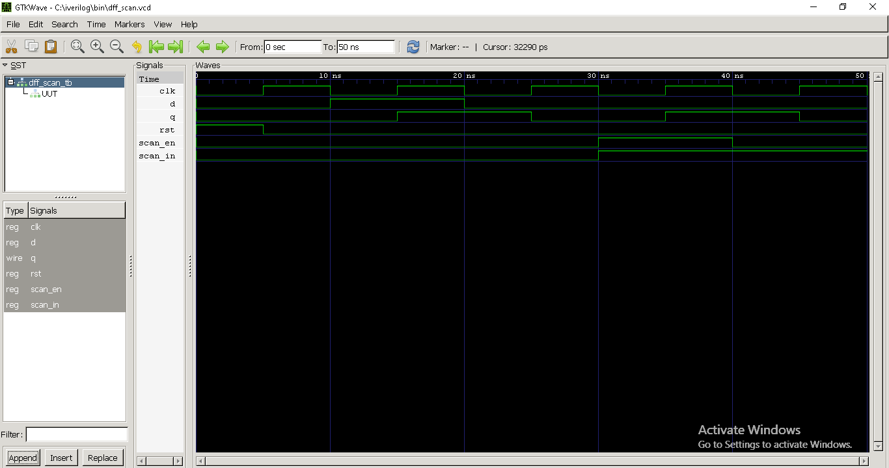

# Project 1: D Flip-Flop with Scan Chain (DFT_Verilog_Project1)

This project demonstrates the RTL design, simulation, and waveform validation of a **D Flip-Flop with Scan Chain** using Verilog. The design is simulated using **Icarus Verilog + GTKWave**, showcasing basic DFT logic.

---

## 🔧 Tools Used

- **Icarus Verilog** – RTL Simulation
- **GTKWave** – Waveform Visualization
- **GitHub** – Code Repository

---

## 📂 Project Structure
DFT_Verilog_Project1/
├── RTL/
│   └── DFF.v
├── Testbench/
│   └── tb.v
├── Waveform/
│   └── Waveform_DFF_scan.png
├── README.md

---

## 📄 Description

- `DFF.v`: Verilog module with `clk`, `rst`, `scan_en`, and `scan_in`.
- `tb.v`: Testbench for driving inputs and generating `.vcd` file.
- `Waveform_DFF_scan.png`: Captured GTKWave image showing functional behavior.

---

## ✅ Simulation Output

---

## 📈 Learning Outcomes

- Scan chain integration in DFF
- RTL coding and simulation flow
- Visual waveform analysis in GTKWave

---

## 📌 Author

**Vishal Singh**  
GitHub: [VishalSingh-ML](https://github.com/VishalSingh-ML)
